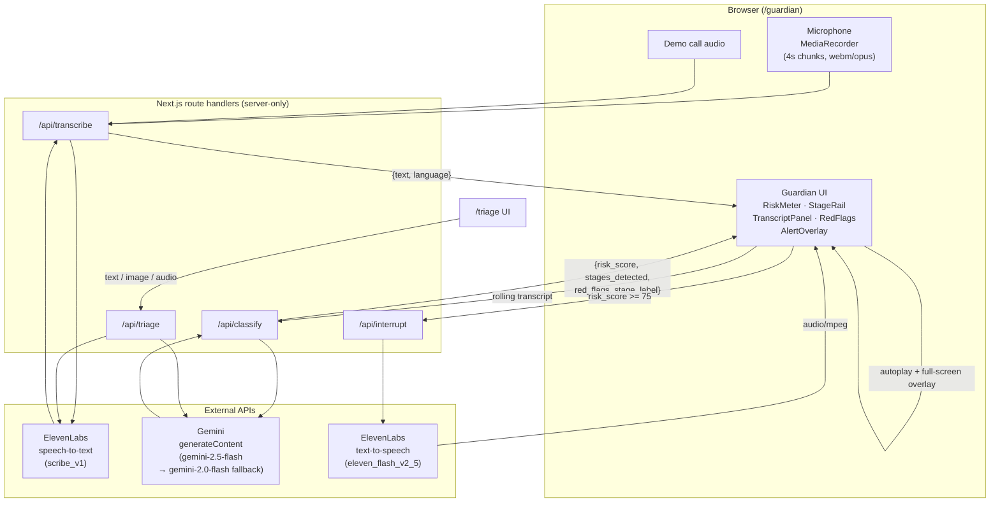

# Kavach — Architecture

## Pipeline overview

## Component & data-flow description

**Capture.** `/guardian` records audio in 4-second chunks via `MediaRecorder`
(`audio/webm;codecs=opus`), from either a live `getUserMedia` microphone stream (Start Listening)
or an `HTMLAudioElement.captureStream()` of the real demo recording being played aloud
simultaneously (Run Demo Call). Both paths feed the identical chunk-processing queue — the demo
is not a mock, it runs the real transcription and classification pipeline against a real audio
file.

**Transcribe.** Each chunk is queued and POSTed to `/api/transcribe` as
`multipart/form-data`, which forwards it to ElevenLabs speech-to-text (`scribe_v1`). Silent or
unintelligible chunks return `{ text: "", language: "" }` rather than throwing, so a quiet moment
in the call never crashes the session. Chunks are processed in strict arrival order via an
in-memory queue so the transcript never reorders, but the classify call for chunk *N* does not
block the transcribe call for chunk *N+1* — never dropping a chunk, never letting one slow request
stall the next.

**Classify.** Every time new text arrives, the full rolling transcript (not just the latest
chunk) is POSTed to `/api/classify`, which sends it to Gemini with the fraud-classifier system
prompt (see below) and `responseMimeType: "application/json"`. The route tries `gemini-2.5-flash`
first, falls back to `gemini-2.0-flash` on a 404, retries once on a 5xx, and strips markdown code
fences before `JSON.parse`. The client merges the returned stages/red-flags/score into session
state — the risk score is a **peak**, it only ever increases within a session (`mergeScore` in
`lib/riskEngine.ts`), matching the classifier's own "never lower a score once stages are
established" rule.

**Interrupt.** The moment the merged risk score crosses 75, `triggerAlert` fires exactly once per
session (guarded by a ref, not state, to survive React's strict-mode double-invocation of
updaters): the full-screen `AlertOverlay` opens immediately, and `/api/interrupt` is called in
parallel with the detected language. That route looks up a pre-written warning in
`lib/warnings.ts` (Hindi, Hindi-English code-mixed, Marathi, Tamil, Telugu, Kannada, Bengali,
English) and synthesizes it via ElevenLabs TTS (`eleven_flash_v2_5`, voice "Adam" —
`pNInz6obpgDQGcFmaJgB`, hardcoded in `lib/elevenlabs.ts`). The resulting `audio/mpeg` stream
autoplays over the overlay. Because playback is always initiated from the same click that started
Start Listening / Run Demo Call, the browser's autoplay gate is already unlocked by the time the
alert fires.

**Triage.** `/triage` is stateless per request: text goes straight to the same Gemini triage
prompt; a screenshot is sent as inline base64 image data for Gemini vision; a recording is first
transcribed via the same ElevenLabs STT call as the live pipeline, then the resulting text is
classified. All three converge on the same `TriageResult` shape (`verdict`, `confidence`,
`red_flags`, `what_to_do`, `complaint_draft`).

## Risk-engine scoring rules

Enforced inside the Gemini system prompt (`CLASSIFIER_PROMPT` in `lib/gemini.ts`), not
recalculated client-side — the client only ever takes the **maximum** of the score it already has
and the score just returned:

| Condition | Score |
|---|---|
| No stages detected | 0 |
| 1 stage detected | 35 |
| 2 stages detected | 70 |
| 3 or more stages detected | 90 |
| Stage 3 (Isolation) detected at all | minimum 85 |
| Stage 5 (Extraction) detected at all | minimum 85 |

The classifier takes the **maximum** of all applicable rules, and is instructed to never lower a
score once stages are established — mirrored client-side by `mergeScore(prev, incoming) =
Math.max(prev, incoming)` so a transient lower reading from a later, noisier chunk can never walk
the gauge backwards mid-call.

The five stages, in the order a genuine digital-arrest script always follows them:

1. **Impersonation** — CBI / ED / Customs / TRAI / Police / RBI / courier company
2. **Accusation** — Aadhaar / SIM / bank account / parcel linked to laundering, drugs, trafficking
3. **Isolation** — stay on video, don't disconnect, don't tell family, "confidential" framing
4. **Fear & pressure** — non-bailable arrest threat, fake warrant, sustained time pressure
5. **Extraction** — "verification account" transfer, or OTP / card / banking credentials
