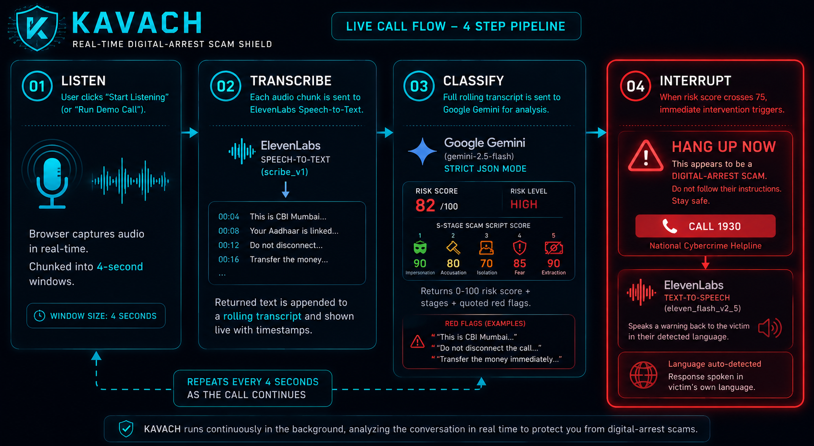
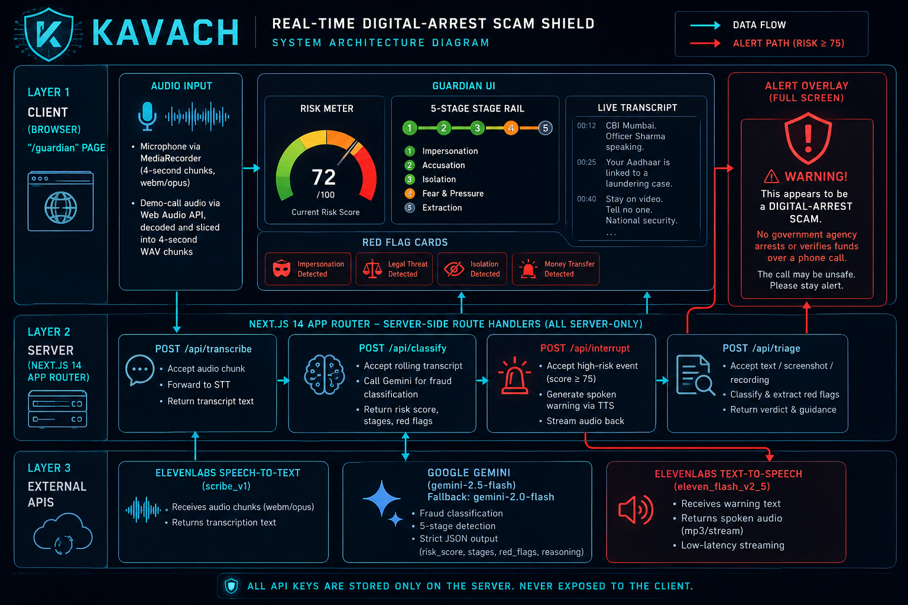
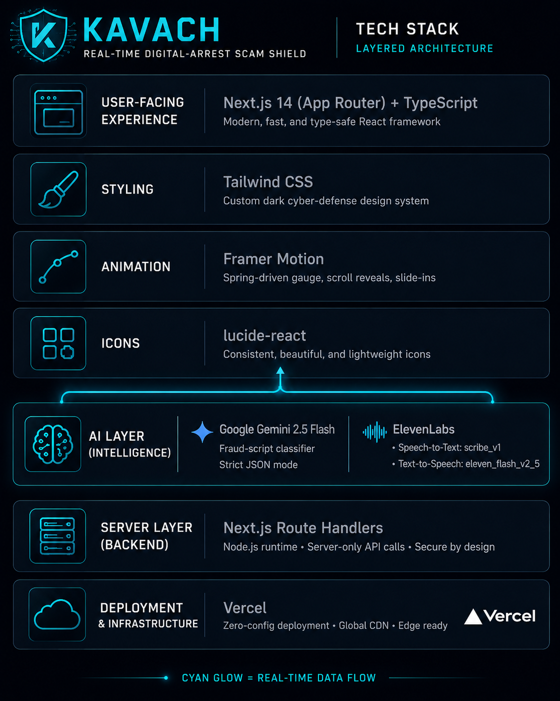

# Kavach — Real-Time Digital Arrest Scam Shield

**Team DeepSeek · ET AI Hackathon 2.0 · Problem Statement 06**

## The problem

"Digital arrest" scams have stolen an estimated **₹4,057 crore** from **2,97,727** reported
Indian victims. A caller impersonates CBI, ED, Customs, or the police, accuses the victim of a
crime tied to their Aadhaar or a parcel, isolates them on a video call, threatens immediate
non-bailable arrest, and extracts a "verification transfer" or OTP before the victim ever gets a
chance to think, hang up, or ask a family member. Every existing defence — bank fraud alerts,
cybercrime helplines, awareness campaigns — acts **after** the call ends and the money is gone.
**Zero tools act during the call itself.**

## The solution

Kavach is a browser-based AI guardian that listens to a call as it happens, transcribes it in
real time, scores it against the rigid five-stage digital-arrest script using Gemini, and — the
moment the risk score crosses the threshold — interrupts with a full-screen warning and a spoken
alert in the victim's own language, with a one-tap route to the national cybercrime helpline
(1930).

It ships with two tools:

- **Guardian** (`/guardian`) — a live command-console that listens to an ongoing call (via the
  microphone, or a real recorded call for demo purposes) and reacts in real time.
- **Triage** (`/triage`) — a point-in-time checker for a suspicious SMS, screenshot, or call
  recording, returning a verdict, red flags, next steps, and a ready-to-file cybercrime complaint.

### Live call flow



## What is built vs. roadmap

**Built today (Phase 1):**
- Live browser Guardian console — real-time semicircular risk gauge, five-stage rail, live
  transcript, red-flag extraction, and a full-screen "HANG UP NOW" alert with a spoken warning.
- A fully-wired real pipeline for both the live microphone and a "Run Demo Call" mode that
  decodes a real recorded scam call and pushes it through the exact same transcribe → classify
  → interrupt pipeline in real time — no mocks.
- Triage tool covering text, screenshot, and recording inputs across seven Indian languages.
- All AI calls (Gemini classification, ElevenLabs speech-to-text and text-to-speech) run
  server-side only; no API key ever reaches the browser.

**Roadmap:**
- **Phase 2** — Android `CallScreeningService` for native call-time protection, WhatsApp/IVR
  channel coverage, a live cyber-cell map for the nearest reporting station.
- **Phase 3** — Telecom-layer call screening at the carrier level, integration with Sanchar Saathi
  and the 1930 helpline, and a bank-side transaction circuit breaker triggered by the live risk
  score.

### Architecture



See [ARCHITECTURE.md](ARCHITECTURE.md) for the full pipeline diagram and scoring rules, and
[DEMO_VIDEO_SCRIPT.md](DEMO_VIDEO_SCRIPT.md) for the 2.5-minute demo runbook.

## Setup

```bash
npm install
cp .env.example .env   # fill in GEMINI_API_KEY and ELEVENLABS_API_KEY
npm run healthcheck    # verifies both API keys work end-to-end
npm run generate-demo-call   # generates public/demo/scam-call.mp3 (only needed once)
npm run dev
```

Open [http://localhost:3000](http://localhost:3000).

## Tech stack



- **Next.js 14** (App Router) + **TypeScript**, deployable to Vercel with zero config
- **Tailwind CSS** — custom cyber-defence design system (dark command-console palette)
- **framer-motion** for the risk gauge, stage-rail, red-flag, and alert animations
- **lucide-react** for iconography
- **Gemini 2.5 Flash** (`generativelanguage.googleapis.com`, falls back to `gemini-2.0-flash`) for
  fraud classification, strict JSON output
- **ElevenLabs** — `scribe_v1` for speech-to-text, `eleven_flash_v2_5` for the spoken warning
  (voice: "Adam", hardcoded in `lib/elevenlabs.ts`)
- All API calls run exclusively in server-side route handlers (`app/api/*/route.ts`)

## Project structure

```
app/
  layout.tsx, page.tsx            home page
  guardian/page.tsx                live guardian console
  triage/page.tsx                  message/screenshot/recording checker
  pitch/page.tsx                   pitch deck page
  api/transcribe, classify,
      interrupt, triage/route.ts   server-side AI route handlers
components/                        RiskMeter, StageRail, TranscriptPanel, RedFlagCard,
                                    AlertOverlay, ControlBar, VerdictCard, Nav, ToastStack
lib/                               types, gemini.ts, elevenlabs.ts, riskEngine.ts, warnings.ts
scripts/                           healthcheck.ts, generate-demo-call.ts
public/demo/scam-call.mp3          generated demo call audio
```

## Team

- **Shivani Santosh Kapase** — Lead
- **Yash Pradip Pakale**
- **Yashawant Dayanand Mane**
- **Prasad Babasaheb Thete**

## Screenshots

_Add screenshots of `/`, `/guardian` (idle and threat-detected states), and `/triage` (verdict
card) here before submission._
